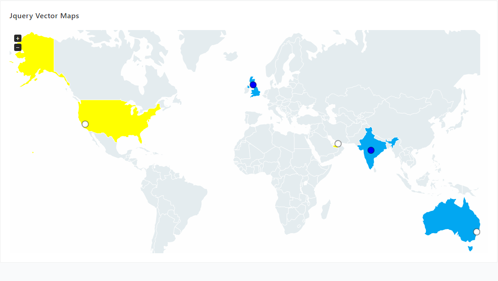

# yii2-jvectormap

[](https://packagist.org/packages/cjtterabytesoft/yii2-jvectormap)
[](https://scrutinizer-ci.com/g/cjtterabytesoft/yii2-jvectormap/?branch=master)
[](https://scrutinizer-ci.com/g/cjtterabytesoft/yii2-jvectormap/build-status/master)
[](https://scrutinizer-ci.com/code-intelligence)
[](https://codeclimate.com/github/cjtterabytesoft/yii2-jvectormap/maintainability)
[](https://www.versioneye.com/user/projects/5ac3f57a0fb24f0ac49c44f0)



Requirements:
-------------

[yii2-app-advanced](https://github.com/yiisoft/yii2-app-advanced/).

[yii2-app-basic](https://github.com/yiisoft/yii2-app-basic/).

Installation:
-------------

The preferred way to install this extension is through [composer](http://getcomposer.org/download/).

#### 1.- Installation:

#####Linux:

```
    php composer.phar require --prefer-dist cjtterabytesoft/yii2-jvectormap "0.0.1.x-dev"
```

#####Windows:

```
    composer require --prefer-dist cjtterabytesoft/yii2-jvectormap "0.0.1.x-dev"
```

#####Or add to composer.json:

```
    "cjtterabytesoft/cjtterabytesoft/yii2-jvectormap": "0.0.1.x-dev"
```

#### 2.- How to Used Jquery yii2-Jvectormap:

```
    <?php

    use cjtterabytesoft\jvectormap\Jvectormap;

    ?>

    <?= Jvectormap::widget([
        /** [div-container-config] **/
        'id' => 'vmap',
        'style' => [
            'height' => '490px',
            'position' => 'relative',
            'overflow' => 'hidden',
            'background-color' => 'transparent',
        ],
        /** [map config] **/
        'map' => 'world_merc',
        'backgroundColor' => '#fefefe',
        'focusOn' => [
            'US',
            'AE',
            'AU',
            'IN',
            'GB',
        ],
        'markers' => [
            [
                'latLng' => [21.00,78.00],
                'name' => 'IND : 350'
            ],
            [
                'latLng' => [-33.00,151.00],
                'name' => 'AUS : 250'
            ],
            [
                'latLng' => [36.77,-119.41],
                'name' => 'USA : 250'
            ],
            [
                'latLng' => [55.37,-3.41],
                'name' => 'UK : 250'
            ],
            [
                'latLng' => [25.20,55.27],
                'name' => 'UAE : 250'
            ],
        ],
        'markersSelectable' => true,
        'markersSelectableOne' => true,
        'markerStyle' => [
            'initial' => [
                'r' => 7,
                'fill' => '#fff',
                'fill-opacity' => 1,
                'stroke' => '#000',
                'stroke-width' => 2,
                'stroke-opacity' => 0.4,
            ],
        ],
        'panOnDrag' => true,
        'regionLabelStyle' => [
            'initial' => [
                'font-family' => 'Verdana',
                'font-size' => '12',
                'font-weight' => 'bold',
                'cursor' => 'default',
                'fill' => 'black',
            ],
            'hover' => [
                'cursor' => 'pointer',
            ],
        ],
        'regionsSelectable' => true,
        'regionsSelectableOne' => true,
        'selectedMarkers' => [0,3],
        'selectedRegions'=> ['US','AE'],
        'regionStyle' => [
            'initial' => [
                'fill' => '#e4ecef',
            ],
        ],
        'series' => [
            'regions' => [
                [
                    'values' => [
                        'US' => 300,
                        'AE' => 200,
                        'AU' => 760,
                        'IN' => 200,
                        'GB' => 120,
                    ],
                    'scale' => ['#03a9f3', '#02a7f1'],
                    'normalizeFunction' => 'polynomial',
                ]
            ],
        ],
        'zoomAnimate' => true,
        'zoomMax' => 8,
        'zoomMin' => 1,
        'zoomOnScroll' => false,
    ]); ?>
    
    Documentation Api: http://jvectormap.com/documentation/javascript-api/jvm-map/
```

#### 3.- Added Maps:

    3.1.- Map World Miller: [world_mill].
    3.2.- Map World Mercator: [world_merc].

Thankful to cjtterabytesoft [Donate Paypal](https://www.paypal.com/cgi-bin/webscr?cmd=_s-xclick&hosted_button_id=LRLATZP493W46).
Your Donation is Important to Further Develop Open Source Software.

[](https://packagist.org/packages/cjtterabytesoft/yii2-jvectormap)
[](https://packagist.org/packages/cjtterabytesoft/yii2-jvectormap)
[](https://packagist.org/packages/cjtterabytesoft/yii2-jvectormap)
