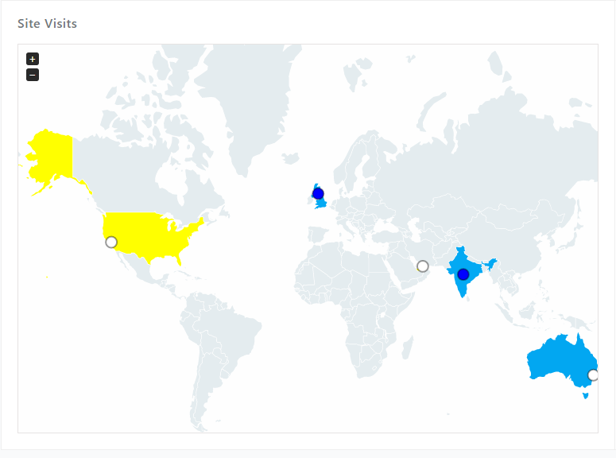
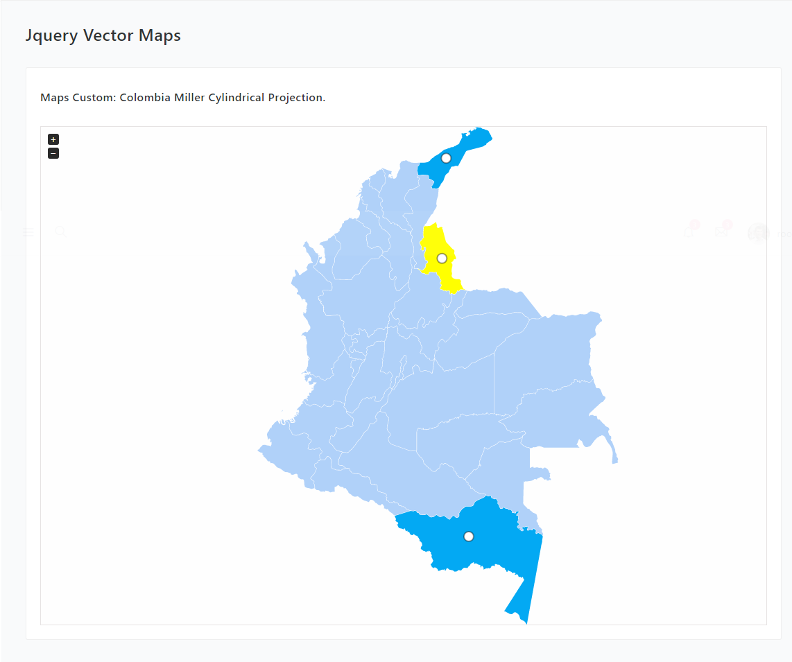

Getting Started with Widget - yii2-jvectormap.
==============================================

#### 1.- Installation:

#####Linux:

```
    php composer.phar require --prefer-dist cjtterabytesoft/yii2-jvectormap "0.0.1-dev"
```

#####Windows:

```
    composer require --prefer-dist cjtterabytesoft/yii2-jvectormap "0.0.1-dev"
```

#####Or add to composer.json:

```
    "cjtterabytesoft/yii2-jvectormap": "0.0.1-dev"
```

#### 2.- Example:

#####With Map Include Widget:



```
<?php

/**
* This file is part of the CJTTERABYTESOFT yii2-jvectormap
*
* (c) CJT TERABYTE LLC yii2-widget <https://github.com/cjtterabytesoft/yii2-jvectormap>
* For the full copyright and license information, please view the LICENSE.md
* file that was distributed with this source code
*
* @link: https://github.com/cjtterabytesoft/yii2-jvectormap
* @author: Wilmer Arámbula <cjtterabytellc@gmail.com>
* @copyright (c) CJT TERABYTE LLC
* @Widget: [yii2-jvectormap]
* @Layout [Plugin_JvectorMaps]
* @since: 0.0.1-dev
**/

use cjtterabytesoft\widget\jvectormap\JvectorMap;
use yii\helpers\Html;

?>

<!- PLUGIN JVECTORMAPS EXAMPLE -!>
<?= Html::beginTag('div', ['class' => 'peer peer-greed w-70p@lg+ w-100@lg- p-20']) ?>
    <?= Html::beginTag('div', ['class' => 'layers']) ?>
        <?= Html::beginTag('div', ['class' => 'layer w-100 mB-10']) ?>
            <?= Html::tag('h6', html::encode(Yii::t('adminator','Site Visits')), ['class' => 'lh-1']) ?>
        <?= Html::endTag('div') ?>
        <?= Html::beginTag('div', ['class' => 'layer w-100']) ?>
            <?= JvectorMap::widget([
                /** [div container] **/
                'id' => 'vmap',
                'style' => [
                    'border' => '1px solid rgba(228, 225, 225, 0.92)',
                    'height' => '490px',
                    'position' => 'relative',
                    'overflow' => 'hidden',
                ],
                /** [map config] **/
                'map' => 'world_merc',
                'backgroundColor' => '#fefefe',
                'focusOn' => [
                    'US',
                    'AE',
                    'AU',
                    'IN',
                    'GB',
                ],
                'markers' => [
                    [
                        'latLng' => [21.00,78.00],
                        'name' => 'IND : 350'
                    ],
                    [
                        'latLng' => [-33.00,151.00],
                        'name' => 'AUS : 250'
                    ],
                    [
                        'latLng' => [36.77,-119.41],
                        'name' => 'USA : 250'
                    ],
                    [
                        'latLng' => [55.37,-3.41],
                        'name' => 'UK : 250'
                    ],
                    [
                        'latLng' => [25.20,55.27],
                        'name' => 'UAE : 250'
                    ],
                ],
                'markersSelectable' => true,
                'markersSelectableOne' => true,
                'markerStyle' => [
                    'initial' => [
                        'r' => 7,
                        'fill' => '#fff',
                        'fill-opacity' => 1,
                        'stroke' => '#000',
                        'stroke-width' => 2,
                        'stroke-opacity' => 0.4,
                    ],
                ],
                'panOnDrag' => true,
                'regionLabelStyle' => [
                    'initial' => [
                        'font-family' => 'Verdana',
                        'font-size' => '12',
                        'font-weight' => 'bold',
                        'cursor' => 'default',
                        'fill' => 'black',
                    ],
                    'hover' => [
                        'cursor' => 'pointer',
                    ],
                ],
                'regionsSelectable' => true,
                'regionsSelectableOne' => true,
                'selectedMarkers' => [0,3],
                'selectedRegions'=> ['US','AE'],
                'regionStyle' => [
                    'initial' => [
                        'fill' => '#e4ecef',
                    ],
                ],
                'series' => [
                    'regions' => [[
                        'values' => [
                            'US' => 300,
                            'AE' => 200,
                            'AU' => 760,
                            'IN' => 200,
                            'GB' => 120,
                        ],
                        'scale' => ['#03a9f3', '#02a7f1'],
                        'normalizeFunction' => 'polynomial',
                    ]],
                ],
                'zoomAnimate' => true,
                'zoomMax' => 8,
                'zoomMin' => 1,
                'zoomOnScroll' => false,
            ]); ?>
        <?= Html::endTag('div') ?>
    <?= Html::endTag('div') ?>
<?= Html::endTag('div') ?>
<!- PLUGIN JVECTORMAPS EXAMPLE -!>
```

#####With Map Custom Colombia Miller Cylindrical Projection:



1.- Copy your Map JS in:
    - frontend/web/maps/js for example:
        JS: jquery-jvectormap-co-mill.js.
        
```
<?php

/**
* This file is part of the CJTTERABYTESOFT yii2-jvectormap
*
* (c) CJT TERABYTE LLC yii2-widget <https://github.com/cjtterabytesoft/yii2-jvectormap>
* For the full copyright and license information, please view the LICENSE.md
* file that was distributed with this source code
*
* @link http://www.tusoporte.net
* @author Wilmer Arámbula <cjtterabytellc@gmail.com>
* @copyright (c) CJT TERABYTE LLC
* @Widget: [yii2-jvectormap]
* @Layout [Vector_Maps]
* @since: 0.0.1-dev
**/

use cjtterabytesoft\widget\jvectormap\JvectorMap;
use yii\helpers\Html;

?>

<!- PLUGIN JVECTORMAPS EXAMPLE CUSTOM MAP-!>
<?= Html::beginTag('div', ['id' => 'mainContent']) ?>
    <?= Html::beginTag('div', ['class' => 'container-fluid']) ?>
        <?= Html::tag('h4', html::encode(Yii::t('adminator','Jquery Vector Maps')),
            ['class' => 'c-grey-900 mT-10 mB-30']) ?>
        <?= Html::beginTag('div', ['class' => 'row']) ?>
            <?= Html::beginTag('div', ['class' => 'col-md-12']) ?>
                <?= Html::beginTag('div', ['class' => 'bgc-white bd bdrs-3 p-20 mB-20']) ?>
                    <?= Html::tag('h6', html::encode(Yii::t('adminator',
                        'Maps Custom: Colombia Miller Cylindrical Projection.')),
                        ['class' => 'c-grey-900 mT-10 mB-30']) ?>
                    <?= JvectorMap::widget([
                        /** [div container] **/
                        'id' => 'vmap',
                        'style' => [
                            'border' => '1px solid rgba(228, 225, 225, 0.92)',
                            'height' => '100vh',
                            'position' => 'relative',
                            'overflow' => 'hidden',
                        ],
                        /** [map config] **/
                        'map' => 'co_mill',
                        'maptype' => true,
                        'backgroundColor' => '#fefefe',
                        'focusOn' => [
                            'CO-AMA',
                            'CO-NSA',
                            'CO-LAG',
                        ],
                        'markers' => [
                            [
                                'latLng' => [-1.26,-71.91],
                                'name' => 'CO-AMA : 0'
                            ],
                            [
                                'latLng' => [11.42,-72.67],
                                'name' => 'CO-LAG : 150'
                            ],
                            [
                                'latLng' => [8.08,-72.81],
                                'name' => 'CO-NSA : 300'
                            ],
                        ],
                        'markersSelectable' => true,
                        'markersSelectableOne' => true,
                        'markerStyle' => [
                            'initial' => [
                                'r' => 7,
                                'fill' => '#fff',
                                'fill-opacity' => 1,
                                'stroke' => '#000',
                                'stroke-width' => 2,
                                'stroke-opacity' => 0.4,
                            ],
                        ],
                        'regionLabelStyle' => [
                            'initial' => [
                                'font-family' => 'Verdana',
                                'font-size' => '12',
                                'font-weight' => 'bold',
                                'cursor' => 'default',
                                'fill' => 'black',
                            ],
                            'hover' => [
                                'cursor' => 'pointer',
                            ],
                        ],
                        'selectedRegions'=> ['CO-NSA'],
                        'regionStyle' => [
                            'initial' => [
                                'fill' => '#b0d1f9',
                            ],
                        ],
                        'series' => [
                            'regions' => [[
                                'values' => [
                                    'CO-AMA' => 0,
                                    'CO-LAG' => 150,
                                    'CO-NSA' => 300,
                                ],
                                'scale' => ['#03a9f3', '#02a7f1'],
                                'normalizeFunction' => 'polynomial',
                            ]],
                        ],
                        'zoomAnimate' => true,
                        'zoomMax' => 8,
                        'zoomMin' => 1,
                        'zoomOnScroll' => false,
                    ]); ?>
                <?= Html::endTag('div') ?>
            <?= Html::endTag('div') ?>
        <?= Html::endTag('div') ?>
    <?= Html::endTag('div') ?>
<?= Html::endTag('div') ?>
<!- PLUGIN JVECTORMAPS EXAMPLE CUSTOM MAP-!>
```        